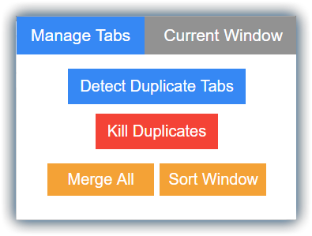
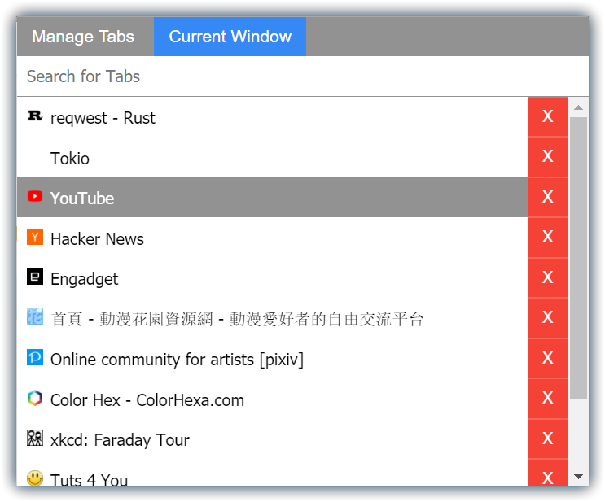

# Tab Manager

Tab Manager is a browser extension that helps you to manage all the tabs. The philosophy behind it is to manage all the tabs within the current window. It is often the case that there should **NOT** be more than 2 or 3 browser windows opened. Thus, the extension itself has a limited or no support for managing multi-window tabs. It is also not planned to add any multi-window tabs support in the future. However, feel free to give any suggestions or design ideas.

The extension works on Chrome and Firefox and have not tested on other browsers. You can download from the links below:

## Features Exploration

The features are mainly divided into 2 parts/tabs: Manage Tabs and Current Window.

 &nbsp;&nbsp;&nbsp; 

### Manage Tabs

There are 3 basic actions on Manage Tabs: merge, sort, and kill duplicates.

**Merge All**

* It will merge tabs from all windows; make use of it will help you greatly!
* The tab's final merged position is relative to its previous position in the window
* Merge serves as the key to manage tabs in one window

**Sort Window**

* Sort helps you to understand the relationship between different tabs
* It will only sort the tabs in current window
* The sorting is based on the domain name in alphabetical order

**Kill Duplicates**

* As the name suggests, it will kill all tabs with duplicate URLs in current window

Other than these 3 basic actions, **Detect Duplicate Tabs** is a background action that can be enabled or disabled.

When there is a new tab with duplicate URLs, it will close all the old duplicates and only leave the new one.

You can toggle the button to change the state and the extension icon will also indicate whether it is enabled or not.

### Current Window

Current Window gives you the ability to delete, move, and search tabs in current window.

* The tabs will be shown vertically. To move the tab position, perform **drag and drop** on the tab
* In order to delete a tab, **click on the red error** on the right or simply by **press key "x"** when hovered
* When **click on the tab**, it will redirect you to that webpage and the current tab will be in dark grey background
* To search a tab, **type on the search** box and it will match the desired tabs and ignore the unmatched

## Contribute to Codebase

Most of the code is written in pure JavaScript and based on ES6 standards. The drag and drop feature is using the dragula APIs for simplicity. If you are confortable with Chrome Extension APIs, you should be good to go. To get started, you can load this project folder in Chrome or open the manifest.json file in Firefox. Looking forward to see some issues and PRs!

Currently, we are planning to move the code to TypeScript and separate some of the functionalities for easier maintainability.
